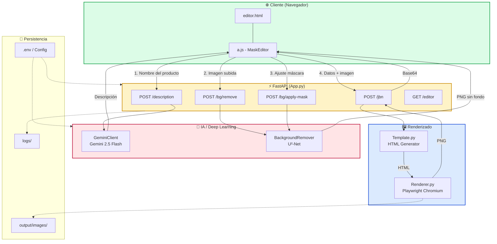
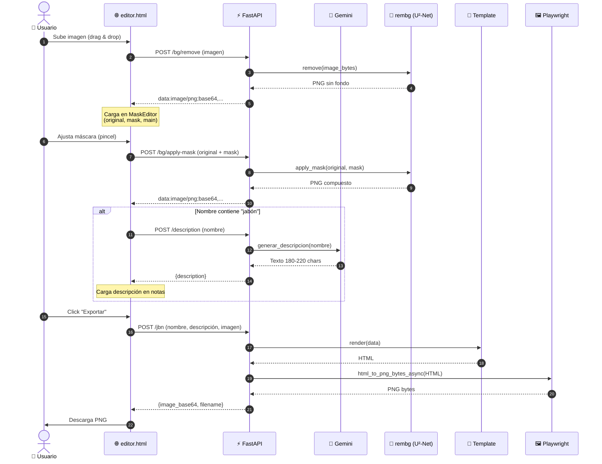
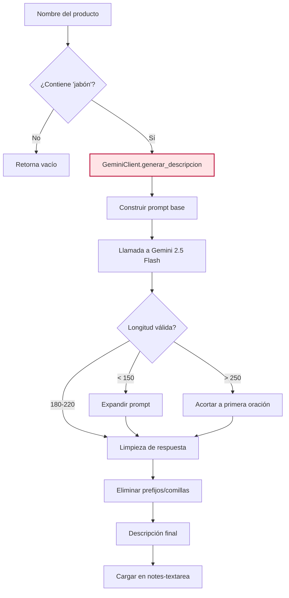
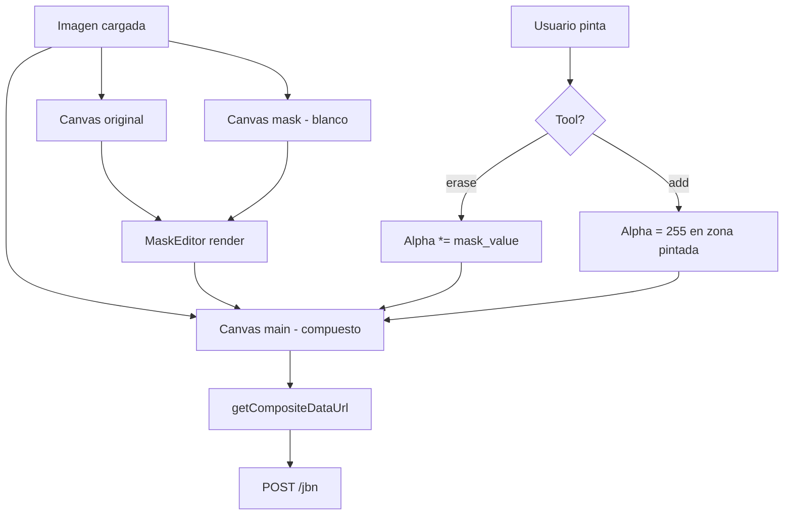

# 🧼 JabonCreator — Generador de Fichas de Producto con IA

Aplicación web (FastAPI) que genera fichas visuales de productos (jabones) combinando **IA generativa (Gemini)**, **remoción de fondo con deep learning (rembg / U²-Net)** y **renderizado HTML → PNG (Playwright)**. Incluye un editor visual de máscaras en el navegador para ajustar manualmente la segmentación del producto.

---

## 📋 Requisitos y configuración inicial

### 1. Instalar dependencias

#### Windows

```bash
python -m venv venv; venv\Scripts\activate; pip install -r requirements.txt
```

#### Linux

```bash
python -m venv venv; source venv/bin/activate; pip install -r requirements.txt
```

### 2. Instalar navegadores de Playwright

```bash
playwright install chromium
```

### 3. Descargar el modelo de rembg (U²-Net)

```bash
python -c "from rembg import new_session; new_session('u2net')"
```

### 4. Configuración de variables de entorno

Crea un archivo `.env` basado en `example` con esta estructura:

```bash
# 🔑 Gemini API (obligatorio para generación de descripciones)
GEMINI_API_KEY=tu_api_key_de_google_ai_studio
GEMINI_MODEL=gemini-2.0-flash-exp

# 🖼️ Render (Playwright)
RENDER_WIDTH=920
RENDER_HEIGHT=380

# 🎨 Template (UI)
FONT_FAMILY=Montserrat
PRIMARY_COLOR=#6b2348
BG_COLOR=#fdf6f6

# 📁 Rutas
OUTPUT_DIR=./output/images
```

> **Nota**: Puedes obtener una API key gratuita de Gemini en [Google AI Studio](https://aistudio.google.com/).

### 5. Ejecución

#### Local (Python)

```bash
python main.py
```

#### Docker Compose

```bash
docker compose up --build
```

La aplicación quedará disponible en `http://localhost:8000`.

---

## 🐳 Docker

El proyecto incluye un `Dockerfile` basado en `python:3.11-slim` con:

- Librerías del sistema para **Playwright/Chromium** (`libnss3`, `libatk-bridge2.0-0`, etc.)
- Librerías para **rembg/Pillow** (`libgl1`, `libglib2.0-0`, etc.)
- **Fuentes** (`fonts-dejavu-core`, `fonts-liberation`, `fonts-noto-core`) para evitar problemas de renderizado
- Descarga del modelo **u2net** durante el build
- Chromium de Playwright preinstalado

```bash
docker compose up --build
```

El `docker-compose.yml` monta volúmenes para **hot-reload** en desarrollo y persiste la caché del modelo y de Playwright.

---

## 📂 Estructura del Proyecto

```
.
├── controller/
│   ├── App.py                    # FastAPI + rutas
│   ├── Config.py                 # Configuración (.env)
│   ├── GeminiClient.py           # 🤖 Cliente de IA generativa (Gemini 2.5 Flash)
│   ├── BackgroundRemover.py      # 🧠 Remoción de fondo con U²-Net
│   ├── BackgroundRemoverAPI.py   # Endpoints /bg/*
│   ├── ImageProcessor.py         # Utilidades de imagen
│   ├── Log.py                    # Sistema de logs
│   ├── Renderer.py               # HTML → PNG (Playwright async)
│   ├── Template.py               # Generador de HTML (ficha de producto)
│   └── utils/
│       ├── crypto.py
│       ├── file.py
│       ├── http.py
│       ├── random_utils.py
│       └── time_utils.py
├── static/
│   ├── a.js                      # MaskEditor (canvas + máscara)
│   ├── st.css                    # Estilos del editor
│   └── icon.png
├── templates/
│   └── editor.html               # UI del editor
├── vendor/
│   ├── input.json                # Datos de producto (ejemplo)
│   ├── icon.svg
│   └── favicon.ico
├── main.py                       # Entry point (FastAPI)
├── Dockerfile
├── docker-compose.yml
├── requirements.txt
└── README.md
```

---

## 🏗️ Arquitectura del Sistema



---

## 🔄 Flujo de Funcionamiento

### Flujo completo (de la imagen al PNG final)



### Flujo del cliente de IA (Gemini)



### Flujo del editor de máscaras (frontend)



---

## 🔌 Endpoints de la API

| Método | Ruta | Descripción |
|---|---|---|
| `GET` | `/` | Info general y listado de endpoints |
| `GET` | `/editor` | UI del editor de máscaras |
| `POST` | `/description` | Genera descripción con **Gemini** |
| `POST` | `/jbn` | Genera imagen final (HTML → PNG) |
| `POST` | `/bg/remove` | Remueve fondo con **U²-Net** |
| `POST` | `/bg/apply-mask` | Aplica máscara manual |
| `GET` | `/bg/info` | Estado del servicio de rembg |

---

## 🤖 Componentes de IA

| Componente | Tecnología | Uso |
|---|---|---|
| **GeminiClient** | Gemini 2.5 Flash (Google) | Generación de descripciones de producto |
| **BackgroundRemover** | rembg + **U²-Net** | Segmentación y remoción de fondo |
| **MaskEditor** | Canvas API (JS) | Ajuste manual de la máscara de segmentación |

---

## 🛠 Herramientas de desarrollo

### Actualizar dependencias

```bash
pip install pipreqs; pipreqs . --force
```

### Comprimir/Descomprimir paquetes offline

#### Windows

```bash
Compress-Archive -Path .\offline_packages\* -DestinationPath offline_packages.zip -CompressionLevel Optimal
Expand-Archive -Path offline_packages.zip -DestinationPath packages
```

#### Linux

```bash
zip -9 -r offline_packages.zip ./offline_packages/
unzip offline_packages.zip -o packages
```

### Modo Offline

```bash
# Instalar desde paquetes locales
pip install --no-index --find-links packages -r requirements.txt

# Descargar paquetes
pip download -r requirements.txt -d ./offline_packages --only-binary :all:
```

### Compilar a ejecutable (.exe)

```bash
python -m PyInstaller --icon="vendor/favicon.ico" --onefile --windowed main.py
```

---

## 🎨 Personalización

Edita el archivo `.env` para cambiar:

- **Fuente**: `FONT_FAMILY=Montserrat`
- **Color primario**: `PRIMARY_COLOR=#6b2348`
- **Fondo**: `BG_COLOR=#fdf6f6`
- **Tamaño de render**: `RENDER_WIDTH=920`, `RENDER_HEIGHT=380`

El template (`controller/Template.py`) genera la ficha con:

- Imagen del producto con `clip-path` diagonal
- Ramas decorativas SVG con color dinámico
- Título, descripción y footer "100% NATURALES Y ECOLÓGICOS"

---

#### 💡 **Créditos**

[Plantilla base](https://github.com/villalbaluis/arquitectura-bots-python) proporcionada por [Luis Villalba](https://github.com/villalbaluis)
